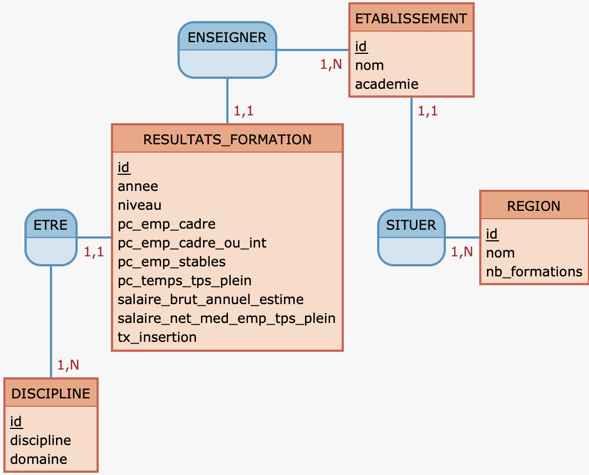

```{r setup, include=FALSE}
options(warn = -1)
knitr::opts_chunk$set(echo = TRUE)
library(reticulate)
matplotlib <- import("matplotlib")
matplotlib$use("Agg", force = TRUE)
```

# Introduction {.label:s-intro}


Dans un monde du travail devenant de plus en plus complexe, avec une multitude de formations proposant divers tremplins, il est logique de se demander lesquelles offrent le plus de débouchés à leurs diplômés. Au-delà de l'analyse pour chaque intitulé de formation ou de discipline, on peut s'intéresser à un aspect géographique de l'enseignement supérieur en France.

\bigskip

\centering

**Dans quelles régions les étudiants sont les mieux formés, entre 2012 et 2019 ?**

\bigskip

\justifying

Nous allons baser notre recherche sur deux jeux de données principaux, proposés par le ministère de l'enseignement supérieur et de la recherche, sur leur plateforme opendata :

<https://data.enseignementsup-recherche.gouv.fr/explore/dataset/fr-esr-insertion_professionnelle-lp/information/>

<https://data.enseignementsup-recherche.gouv.fr/explore/dataset/fr-esr-insertion_professionnelle-master/information/>

\medskip

Ce sont les résultats d'une enquête sur l'insertion professionnelle des étudiants après le master et la licence pro, pour chaque formation de chaque établissement, entre 2012 et 2019. Les données récoltées comprennent le type d'emploi obtenu, les salaires et le chômage.

\justifying

En complément, nous allons utiliser un autre jeu de données disponible sur la même plateforme, qui contient tous les principaux diplômes et formations préparés dans les établissements publics sous tutelle du ministère en charge de l'Enseignement supérieur :

<https://data.enseignementsup-recherche.gouv.fr/explore/dataset/fr-esr-principaux-diplomes-et-formations-prepares-etablissementstable/>

\medskip

Nous sommes aujourd'hui en deuxième année de licence MIASHS, et nous commençons à nous poser des questions sur la poursuite de nos études. Savoir quelle région de France offre le plus de réussite après le diplôme est une donnée importante, qui peut orienter les choix de master de n'importe qui, et c'est pour cette raison que cette question nous intéresse.

# Base de données

## Descriptif des tables

Parmi les jeux de données proposés initialement figurait une table par type de diplôme : Master, Licence Pro, DUT et Doctorat. Pour aller dans le sens de notre question, nous avons dû écarter les DUT car les données étaient nationales, c'est à dire non détaillées par établissement, et les Doctorats car l'enquête ne concernait que les diplômés de l'année 2014.

\medskip

Il nous reste donc deux tables avec le bilan de l'insertion professionnelle pour les formations de type Master et Licence Pro en France. La similarité des tables nous permet de les fusionner en une seule table, puisqu'elles possèdent les mêmes colonnes. Cela nous fait un CSV de 28035 lignes à traiter, que nous allons filtrer et basculer dans une base de données SQL.

\medskip

Afin de pouvoir construire une analyse non perturbée par des valeurs manquantes, nous avons décidé de filtrer au préalable sur Excel puis ensuite sur MySQL en supprimant les lignes contenant des cases vides ou assimilés à la valeur « non-définie ». Après ce prétraitement, sur les 28035 lignes à traiter, il nous en reste 9665.

\medskip

Nous avons aussi filtré nos colonnes de cette façon :

\medskip

-   Pour garder une certaine cohérence vis-à-vis de notre sujet, nous avons décidé de garder celles décrivant l'année, l'académie ainsi que l'établissement pour obtenir les informations spatio-temporelles nécessaires à notre problématique.
-   Nous avons ensuite le type de diplôme : Master ou Licence Pro, le domaine et la discipline pour conserver les informations concernant la formation.
-   Pour finir, nous avons préservé les colonnes concernant les statistiques économiques de l'emploi à la sortie des formations : le pourcentage d'emplois cadres, de cadres ou professions intermédiaires, d'emplois stables, et d'emplois à temps plein. Afin de pouvoir davantage analyser la qualité de l'emploi obtenu, nous avons jugé important de conserver deux colonnes concernant la rémunération de ces emplois : salaire brut annuel estimé et salaire net médian des emplois à temps plein. Pour finir, nous avons gardé la variable du taux d'insertion, statistique primordiale pour savoir si une formation offre une perspective d'emploi une fois le diplome obtenu.

```{=tex}
\begin{flushleft}
\begin{tabular}{|l|l|p{6cm}|}
\hline
\textbf{Nom colonne} & \textbf{Type} & \textbf{Description} \\ \hline
Année & Entier & Année de la fin de formation \\
Académie & Varchar(16) & Nom de l’Académie de la formation \\
Etablissement & Varchar(46) & Nom de l’établissement \\
Diplôme & Varchar(11) & Nom du diplôme obtenu à la fin de la formation \\
Discipline & Varchar(57) & Nom de la discipline du diplôme \\
Domaine & Varchar(31) & Nom du domaine du diplôme \\
\% emplois cadre & Entier & Part des emplois cadre parmi tous les emplois obtenus \\
\% emplois cadre ou professions intermédiaires & Entier & Part des emplois ou professions intermédiaires cadre parmi tous les emplois obtenus \\
\% emplois stable & Entier & Part des emplois stables parmi tous les emplois obtenus \\
\% emplois à temps plein & Entier & Part des emplois à temps plein parmi tous les emplois obtenus \\
Salaire brut annuel estimé & Entier & Valeur du Salaire brut annuel estimé \\
Salaire Net médian des emplois à temps plein & Entier & Valeur du Salaire net médian des emplois à temps plein \\
Taux d’insertion & Entier & Taux d’insertion \\ \hline
\end{tabular}
\end{flushleft}


```
Table : Insertion Professionnelle (9665 $\times$ 12)

\medskip

Nos colonnes ne contiennent pas de valeurs manquantes et chacune des valeurs est considérée comme non-uniques.

\medskip

Avec nos données restantes, nous allons fragmenter notre table en plus petites parties, comme détaillé dans notre MCD qui suit.

## Modèles MCD et MOD

\medskip


{#uml width="14cm" height="8cm"}


{#uml width="16cm" height="8cm"}
\medskip


## Requêtes réalisées

\scriptsize

```{r include=FALSE}
library(DBI)
bd <- DBI::dbConnect(
  drv = RMySQL::MySQL(),    # database driver à utiliser
  host = "localhost", # parfois: host = "localhost"
  port = 8889,              # le port s'affiche parfois dans l'URL de votre navigateur 
  username = "root", # parfois: user = "root"
  password = "root",  # si pas de mot de passe. mettre: password = ""
  dbname = "projetG1TD1",    # nom de votre base
  unix.sock = "/Applications/MAMP/tmp/mysql/mysql.sock"
)
```

\normalsize

-   Nombre d'établissements par region: \scriptsize

```{sql connection=bd, max.print = 13, tab.cap = "Nombre d'établissements par région"}
SELECT region.nom AS Nom, COUNT(*) AS "Nombre"
FROM etablissement, region
WHERE region.id = etablissement.id_region AND region.id != 1
GROUP BY region.id;

```


\normalsize

-   Nombre d'enregistrements dans la table `resultats_formation` par année : \scriptsize

```{sql connection=bd, tab.cap = "Nombre d'enregistrements par année"}
SELECT Annee, COUNT(*) AS 'Nombre' 
FROM resultats_formation 
GROUP BY Annee 
ORDER BY Annee ASC
```

\normalsize

-   Nombre d'enregistrements par année, par région \scriptsize

```{sql connection=bd, tab.cap = "Nombre d'enregistrements par année et par région (10 premiers résultats)"}
SELECT Annee, id_region, region.nom, COUNT(resultats_formation.id) 
AS 'NbEntre' 
FROM resultats_formation, etablissement, region
WHERE resultats_formation.id_etablissement = etablissement.id 
AND etablissement.id_region = region.id
GROUP BY id_region, Annee 
ORDER BY Annee, id_region; 

```


\normalsize

-   Moyenne du taux d'insertion dans les formations par région et par année \scriptsize

```{sql connection=bd, tab.cap = "Moyenne du taux d'insertion dans les formations par région et par année (10 premiers résultats)"}
SELECT Annee, id_region, region.nom, 
AVG(resultats_formation.tx_insertion)AS 'Moyenne' 
FROM resultats_formation, etablissement, region 
WHERE resultats_formation.id_etablissement = etablissement.id 
AND etablissement.id_region = region.id 
GROUP BY id_region, Annee 
ORDER BY Annee, AVG(resultats_formation.tx_insertion) DESC 
```

\normalsize

-   Moyenne emplois stables à la sortie des formations par région et par année \scriptsize

```{sql connection=bd, tab.cap = "Moyenne emplois stables à la sortie des formations par région et par année (10 premiers résultats)"}
SELECT Annee, id_region, region.nom, 
AVG(pc_emp_stables) AS 'Moyenne' 
FROM resultats_formation, etablissement, region 
WHERE resultats_formation.id_etablissement = etablissement.id 
AND etablissement.id_region = region.id 
GROUP BY id_region, Annee 
ORDER BY Annee, AVG(resultats_formation.pc_emp_stables) DESC 
```

\normalsize

-   Moyenne salaire net médian pour les emplois à temps plein par région et par année \scriptsize

```{sql connection=bd, tab.cap = "Moyenne salaire net médian pour les emplois à temps plein par région et par année (10 premiers résultats)"}
SELECT Annee, id_region, region.nom, 
AVG(salaire_net_med_emp_tps_plein) AS Moyenne
FROM resultats_formation, etablissement, region 
WHERE resultats_formation.id_etablissement = etablissement.id 
AND etablissement.id_region = region.id 
GROUP BY id_region, Annee 
ORDER BY Annee, Moyenne DESC
```

\normalsize

# Matériel et Méthodes

## Logiciels

\medskip

Pour traiter les données, les lire et les manipuler : \medskip

-   MySQL5.7.40 \| 8.0.31[@tidyverse]\footnote{MySQL est un système de gestion de bases de données relationnelles. [En savoir plus](https://dev.mysql.com/doc/) }

-   MySQL Workbench 8.0.31 [@tidyverse]\footnote{MySQL Workbench est un outil visuel unifié pour les architectes de bases de données, les développeurs et les DBA. [En savoir plus](https://www.mysql.com/products/workbench/) }

-   RStudio 4.2.2[@tidyverse]\footnote{RStudio est un environnement de développement gratuit, libre et multiplateforme pour R, un langage de programmation utilisé pour le traitement de données et l’analyse statistique. [En savoir plus](https://www.r-studio.com/fr/) }

-   R 4.3[@tidyverse]\footnote{R is ‘GNU S’, a freely available language and environment for statistical computing and graphics which provides a wide variety of statistical and graphical techniques: linear and nonlinear modelling, statistical tests, time series analysis, classification, clustering, etc.  [En savoir plus](https://www.r-project.org/) }

-   Microsoft Excel [@tidyverse]\footnote{Microsoft Excel est un logiciel tableur de la suite bureautique Microsoft Office développé et distribué par l'éditeur Microsoft [En savoir plus](https://www.microsoft.com/fr-fr/microsoft-365/excel) }

    \medskip

Pour collaborer:

-   filess.io [@tidyverse]\footnote{Services de base de données basés sur des plans pour les développeurs. [En savoir plus](https://filess.io/) }

-   Discord [@tidyverse]\footnote{Discord est un logiciel propriétaire gratuit de VoIP et de messagerie instantanée. [En savoir plus](https://discord.com/) }

-   Google Docs [@tidyverse]\footnote{Google Docs est un traitement de texte en ligne inclus dans la suite Web gratuite Google Docs Editors proposée par Google. [En savoir plus](https://www.google.fr/intl/fr/docs/about/) }

-   Google Sheets [@tidyverse]\footnote{Google Sheets est une application de feuille de calcul incluse dans la suite Web gratuite Google Docs Editors proposée par Google; [En savoir plus](https://www.google.fr/intl/fr/sheets/about/) }

    \medskip

Ordinateurs utilisées :

-   Nom : LAPTOP-KUU4P8BA, Processeur : AMD Ryzen 3 3200U with Radeon, Vitesse du Processeur : 2.60 GHz, Mémoire RAM : 8Go, Système D'exploitation : Windows 10 64bits

    \medskip

## Description des Données


Les données sélectionnées ont été stockées dans une base de données MySQL, qui est hébergée en ligne à l'aide de filess.io, ainsi que localement sur les ordinateurs individuels. L'export de cette base de données pèse 343 Ko. Elle est composée de cinq tables différentes, résultant des jeux de données importés (cf. chapitre 2), et contient dix variables.

## Nettoyage des données

Pour la Table "Insertion Profesionnelle" : \medskip

Afin de pouvoir construire une analyse non perturbée par des valeurs manquantes, nous avons décidé de filtrer au préalable sur Excel en supprimant les lignes contenant des cases vides ou assimilés à la valeur « non-définie ». Après ce prétraitement, sur les 28035 lignes à traiter, il nous en restait 9665.


## Étapes de Pré-traitements

Une fois nos fichiers CSV comportant nos données nettoyés, nous les avons importé dans notre base de données SQL. A partir de requêtes SQL nous avons pu extraire les données nécessaire à la création et au remplissage de nos tables : récupération de toutes les régions, création des clés étrangères, sélection et séparation des colonnes.

## Modélisation statistique

Notre modélisation statistique repose sur des tests de l’ANOVA : test d’égalité des moyenne afin d’écarter ou non des hypothèses d’indépendance entre deux variables. Nous avons choisi cette approche après observation de nos données, pour déterminer si la région est déterminante ou non dans la réussite.

# Analyse Exploratoire des Données

\normalsize

Pour commencer notre analyse statistique, nous allons regarder comment se comportent nos variables, à l'aide de requêtes SQL et de script R.

## Années 

On regarde le nombre d'enregistrements que l'on a par année dans notre table resultats_formation.

```{r echo=FALSE}
annees <- fetch(dbSendQuery(bd,"SELECT Annee, COUNT(id) AS 'count' FROM resultats_formation GROUP BY Annee ORDER BY Annee"))
```

```{r echo=FALSE}
barplot(annees$count,names.arg = annees$Annee, main="Nombre de résultats par année",xlab="Années",ylab="Nombre")
```

\medskip

On remarque que le nombre d'enregistrements est stable entre 2013 et 2019, mais inférieur de moitié en 2012.

## Niveaux 
On cherche maintenant à distinguer dans ces enregistrements les niveaux, master et licence pro.

```{r include=FALSE}
niv <- fetch(dbSendQuery(bd,"SELECT Annee, Niveau, COUNT(id) AS 'count' FROM resultats_formation WHERE niveau != 'MASTER ENS' GROUP BY Annee, niveau ORDER BY Annee"))
x <- matrix(c(niv[niv$Niveau == "MASTER LMD",]$count,0,niv[niv$Niveau == "LICENCE PRO",]$count),nrow=2,ncol=8,byrow=TRUE)
rownames(x) <- c("MASTER LMD","LICENCE PRO")
colnames(x) <- levels(as.factor(niv$Annee))
```

```{r echo=FALSE}
barplot(x,main="Niveaux de formation par année",xlab="Année",ylab="Nombre",col=c("cyan","orange"), beside=TRUE)
legend("topright",c("MASTER LMD","LICENCE PRO"),fill=c("cyan","orange"))
```

\medskip


La différence remarquée en 2012 est due à l'absence de réponses pour les Licences Professionnelles au cours de cette période. Nous constatons qu'il y a globalement moins de réponses pour les Licences Professionnelles que pour les Masters.

## Nombre d'établissements
Nous avons 13 régions et 81 établissements, mais on voudrait savoir comment ces derniers sont répartis dans la France.

```{r include=FALSE}
etabReg <- fetch(dbSendQuery(bd,"SELECT region.nom, count(etablissement.id) AS count FROM etablissement, region WHERE id_region = region.id AND id_region != 1 GROUP BY id_region"))
```

```{r echo=FALSE}
barplot(etabReg$count,names.arg = etabReg$nom, main="Etablissements par région",xlab="Années",ylab="Nombre",las=2, col="red")
```

\medskip

Ce qui est marquant est la supériorité de l’Ile-de-France, qui s’explique par le fait qu’elle est la région la plus riche de France, avec presque le double d’établissements par rapport à l’Auvergne-Rhone-Alpes, deuxième région la plus importante de notre pays.

Après avoir regardé les variables qui subdivisent notre jeu de données, on va analyser les variables qui vont apporter des réponses à notre question. Pour chaque variable, nous faisons la moyenne de chaque enregistrements par région, puis on analyse les disparités entre chaque. 
  
## Taux d'emploi

Tout d'abord, on observe les pourcentages d'emploi : % emploi cadre, % emploi cadre ou intermédiaire, % emploi stable, % emploi à temps plein

```{r echo=FALSE}
library(fmsb)
spider <- function(res) {
    for (i in 3:6) {
        nb <- res[i]
        nb <- data.frame(t(nb))
        colnames(nb) <- res$nom
        nb <- rbind(rep(100,13),rep(0,13),nb)
        radarchart( nb  , axistype=1 , pcol=rgb(0.2,0.5,0.5,0.9) , pfcol=rgb(0.2,0.5,0.5,0.5) , plwd=1 , 
                    cglcol="grey", cglty=1, axislabcol="grey", caxislabels=seq(0,100,25), cglwd=0.8, vlcex=0.8, title = row.names(nb)[3])
    }
}

data <- fetch(dbSendQuery(bd, "SELECT e.id_region,r.nom,
                                  AVG(rf.pc_emp_cadre) AS '% emploi cadre',
                                  AVG(rf.pc_emp_cadre_ou_int) AS '% emploi cadre ou intermédiaire',
                                  AVG(rf.pc_emp_stables) AS '% emploi stable',
                                  AVG(rf.pc_temp_tps_plein) AS '% emploi à temps plein'
                          FROM resultats_formation AS rf, etablissement AS e, region as r 
                          WHERE Annee = 2019 AND rf.id_etablissement = e.id AND e.id_region = r.id AND e.id_region != 1 
                          GROUP BY e.id_region
                          ORDER BY e.id_region;"))

par(mfrow = c(1, 2), mex=0.1, cex=0.7)

spider(data)
```

\medskip

Nous obtenons quatre 'spider plots'. Nous constatons que les formations en Île-de-France conduisent à davantage d'emplois cadres, avec une différence de 10% par rapport à la Nouvelle-Aquitaine. Pour les autres variables, chaque région présente des résultats assez similaires : entre 94,4% et 96,2% pour les emplois à temps plein et entre 75,87% et 81,47% pour les emplois stables.

## Salaires
Ensuite, nous allons comparer les salaires entre régions.
\medskip

```{r echo=FALSE}
library(fmsb)

spiderSalaire <- function(res) {
    for (i in 3:4) {
        nb <- res[i]
        nb <- data.frame(t(nb))
        colnames(nb) <- res$nom
        if (i == 3) {
            nb <- rbind(rep(35000,13),rep(25000,13),nb)
            radarchart( nb  , axistype=1 , pcol=rgb(0.2,0.5,0.5,0.9) , pfcol=rgb(0.2,0.5,0.5,0.5) , plwd=1 , 
                        cglcol="grey", cglty=1, axislabcol="grey", caxislabels=seq(25000,35000,2500), cglwd=0.8, vlcex=0.8, title = row.names(nb)[3]) 
        } else if (i == 4) {
            nb <- rbind(rep(2250,13),rep(1250,13),nb)
            radarchart( nb  , axistype=1 , pcol=rgb(0.2,0.5,0.5,0.9) , pfcol=rgb(0.2,0.5,0.5,0.5) , plwd=1 , 
                        cglcol="grey", cglty=1, axislabcol="grey", caxislabels=seq(1250,2250,250), cglwd=0.8, vlcex=0.8, title = row.names(nb)[3]) 
        }
    }
}

data <- fetch(dbSendQuery(bd, "SELECT e.id_region,r.nom,
                                  AVG(rf.salaire_brut_annuel_estime) AS 'Salaire brut annuel estimé',
                                  AVG(rf.salaire_net_med_emp_tps_plein) AS 'Salaire médian emploi temps plein'
                          FROM resultats_formation AS rf, etablissement AS e, region as r 
                          WHERE Annee = 2019 AND rf.id_etablissement = e.id AND e.id_region = r.id AND e.id_region != 1 
                          GROUP BY e.id_region
                          ORDER BY e.id_region;"))

par(mfrow = c(1, 2), mex=0.1, cex=0.7)

spiderSalaire(data)
```

\medskip

En ce qui concerne les salaires, l'Ile-de-France est la région où les diplômés sont mieux rémunérés. Cette situation s'explique par le coût de la vie plus élevé dans cette région, mais indique également une tendance chez les diplômés à rester dans la région où ils ont été formés, quelle que soit cette région. Les autres régions présentent des niveaux de salaires équivalents, sans valeur aberrante comme celle de l’Ile-de-France, et qui suivent graduellement et de manière logique le niveau de richesse de chaque.  

## Taux d'insertion
Au final, nous observons les données sur les taux d'insertion.

```{r echo=FALSE}

data <- fetch(dbSendQuery(bd, "SELECT e.id_region,r.nom,
                                  AVG(rf.tx_insertion) AS 'Tx'
                          FROM resultats_formation AS rf, etablissement AS e, region as r 
                          WHERE Annee = 2019 AND rf.id_etablissement = e.id AND e.id_region = r.id AND e.id_region != 1 
                          GROUP BY e.id_region
                          ORDER BY e.id_region;"))

nb <- data[3]
nb <- data.frame(t(nb))
colnames(nb) <- data$nom
nb <- rbind(rep(100,13),rep(0,13),nb)
radarchart( nb  , axistype=1 , pcol=rgb(0.2,0.5,0.5,0.9) , pfcol=rgb(0.2,0.5,0.5,0.5) , plwd=1 , 
            cglcol="grey", cglty=1, axislabcol="grey", caxislabels=seq(0,100,25), cglwd=0.8, vlcex=0.8, title = "Taux d'insertion")

par(mfrow = c(1, 2), mex=0.1, cex=0.7)
```
\medskip

Toutes les régions ont un taux d’insertion compris entre 90 et 93%, ce qui est une différence non significative.

Au vu de la similarité des résultats de chaque variable sur nos 13 régions, nous sommes en mesure de nous poser la question de l'indépendance entre nos résultats et les régions françaises. C'est ce que nous allons désormais essayer de chercher.


# Analyse et Résultats

Dans le but de répondre à notre problématique, il est nécessaire d'établir une corrélation entre les différentes régions et le succès d'une formation. Ainsi, pour mener à bien cette étude, nous avons effectué des tests d'ANOVA (Analyse de Variance) sur les données de nos établissements en les regroupant selon leur région (à l'aide de la colonne "id_region"), en vue d'identifier une éventuelle dépendance. Pour réaliser ces tests d'ANOVA sur R, il convient d'utiliser la fonction "aov" (voir Annexe 1).

\medskip

```{=tex}
\begin{flushleft}
\begin{tabular}{|l|p{14cm}|}
\hline
\textbf{Indicateur} & \textbf{Explication}  \\ 
\hline
df                  & les degrés de liberté associés à chaque source de variation \\
Sum Sq              & la somme des carrés associée à chaque source de variation   \\
Mean Sq             & la moyenne des carrés associée à chaque source de variation \\
F-value             & la statistique F associée à chaque source de variation, qui mesure le rapport de la variance expliquée par cette source à la variance résiduelle \\
Pr(\textgreater{}F) & la valeur p associée à la statistique F, qui indique la significativité des différences entre les groupes ou l'effet d'un facteur \\  
\hline
\end{tabular}
\end{flushleft}

```

\medskip

```{r echo=FALSE}
data.2019 <- dbFetch(dbSendQuery(bd, 
 "SELECT e.id_region,r.nom,
             AVG(rf.pc_emp_cadre) AS '% emploi cadre',
             AVG(rf.pc_emp_cadre_ou_int) AS '% emploi cadre ou intermédiaire',
             AVG(rf.pc_emp_stables) AS '% emploi stable',
             AVG(rf.pc_temp_tps_plein) AS '% emploi à temps plein',
             AVG(rf.salaire_net_med_emp_tps_plein) AS 'Salaire médian emploi temps plein',
             AVG(rf.salaire_brut_annuel_estime) AS 'Salaire brut annuel',
             AVG(rf.tx_insertion) AS 'Taux dinsertion'
     		  FROM resultats_formation AS rf, etablissement AS e, 
    region as r 
     		  WHERE Annee = 2019 AND rf.id_etablissement = e.id 
  AND e.id_region = r.id AND e.id_region != 1 
             GROUP BY e.id_region
             ORDER BY e.id_region;"))

anova <- function(data) {
    for (i in 3:9) {
        fit <- aov(data[,i] ~ id_region, data)
        print(names(data)[i])
        print(summary(fit)) 
    }
}

```

Résultats :

```{r}
anova(data.2019)
```
Si la valeur de Pr(>F) est inférieure à $\alpha$ = 0,05, nous pouvons rejeter l'hypothèse nulle de l'ANOVA selon laquelle toutes les moyennes conditionnelles sont égales et conclure qu'il existe une différence statistiquement significative entre les moyennes des trois groupes.
Toutefois, nous remarquons que la valeur de Pr(>F) est largement supérieure à $\alpha$ pour toutes les variables. Par conséquent, nous ne pouvons pas rejeter l'hypothèse nulle de l'ANOVA, ce qui suggère que la variable Région n'affecte peut-être pas ces variables nécéssaires pour l'évaluation de la réussite d'une formation.


# Discussion

Étant donné que les variables que nous avons choisies pour évaluer la qualité des formations sont toutes indépendantes de la région, nous pouvons conclure que les résultats d'une formation et donc sa qualité à former les étudiants ne dépendent pas de la région. Par conséquent, la problématique ne pourra être résolue car il ne serait pas pertinent de déterminer qu'une région forme mieux les étudiants qu'une autre, étant donné que cette relation n'est pas avérée. Toutefois, il est important de noter que seuls les diplômes universitaires tels que les Masters LMD et les Licences Professionnelles ont été étudiés. Les résultats auraient pu être différents si d'autres types de diplômes, tels que les grandes écoles (ingénieurs, commerce...) ou les doctorats, avaient été pris en compte. L'étude a également porté sur les résultats généraux des établissements et non pas par domaine, il se peut donc que certaines régions soient spécialisées dans certains domaines plus que d'autres.

# Conclusion et perspectives {.label:ccl}

En résumé, l'analyse des diplômes de Master et de Licence Pro montre que la réussite des étudiants ne dépend pas de la région où ils étudient. Cependant, pour une analyse plus complète, il serait pertinent d'inclure d'autres types de diplômes certifiés par l'État, tels que les écoles privées et les écoles d'ingénieurs, et de les comparer entre eux. Une analyse plus fine de la réussite par discipline ou domaine pourrait également conduire à des résultats plus concluants. En outre, d'autres facteurs tels que le niveau socio-économique des étudiants, leur âge, leur sexe, leur expérience professionnelle et leur lieu de résidence pourraient être pris en compte pour comprendre les différences de réussite. Enfin, une comparaison des résultats avec d'autres pays pourrait fournir des informations utiles sur les performances des étudiants en France par rapport à celles des autres pays.

Il est important de noter que l'étude sur le long terme a été incluse en annexe de ce rapport car la conclusion est similaire à celle de l'étude sur l'année 2019. Cette étude longitudinale a permis de suivre la réussite des diplômés sur plusieurs années, et bien qu'elle ne soit pas incluse dans l'analyse principale, elle fournit des informations supplémentaires sur les performances des étudiants à long terme. Les résultats de l'analyse longitudinale suggèrent que la réussite des étudiants est relativement stable sur plusieurs années, ce qui renforce les conclusions de l'étude principale sur la non-dépendance de la réussite des étudiants à la région où ils étudient.

\medskip

Tout au long de notre travail, différentes difficultés se sont présentées à nous:
```{=tex}
\begin{itemize}
\item Grand nombre de valeurs manquantes
\item Problème d'importation des données car fichier trop volumineux
\item Problème de compatibilité des bases de données entre Windows / MacOS
\item Tentative de récupération de données supplémentaires finalement avérée inutile (voir Annexe 2)
\end{itemize}
```
# Bibliographie {.unnumbered}

::: {#refs}
:::

```{=tex}
\bibliographystyle{elsarticle-harv}
\bibliography{references}
```
# Annexes {.unnumbered}
\setcounter{page}{1}

## Programme R de l'ANOVA {.unnumbered}
Exemple de l'utilisation de la fonction aov avec le jeu de données "iris":
```{r}
# Charge le jeu de données iris pour l’exemple
data(iris)

# Effectue le test de l’ANOVA sur la taille des sepal pour chaque espèce
# Sepal.Length est la variable numérique et Species indique les groupes
fit <- aov(Sepal.Length ~ Species, data = iris) 

# Montre un résumé des résultats
summary(fit)
```

Summary(fit) retourne ainsi des dataframes avec 2 lignes: Species (correspond à la variable numérique y): les valeurs prédites pour chaque observation residuals: la différence entre les valeurs observées et les valeurs prédites

\pagebreak

## Mobilité des diplômés {.unnumbered}
Structure d'une feuille xlsx contenant les données sur les mobilités des diplômés
de Master (semblable à la feuille correspondant aux Licences Pro):
```{r}
library(openxlsx)
data.master <- openxlsx::read.xlsx('data/data-mobilites.xlsx', sheet = 1)
str(data.master)
```

Ces données sont celles que nous avions manuellement entrées dans un fichier xls.
Nous les avions récupérées dans l'objectif de calculer une espérance de salaire en sortant d'un établissement
mais nous nous sommes rendus compte que notre calcul allait finalement nous ramener aux valeurs
des salaires déjà présents dans notre base de données et nous n'aurions peut-être fait
qu'erroner les valeurs.

\pagebreak

## Etude longitudinale {.unnumbered}

Nous sommes arrivée à la conclusion qu’il n’y avait pas de grandes différences entre l’année 2012 et 2019 au niveau des variables statistiques tel que le pourcentage d’employé cadre, ou encore le taux d’insertion professionnel. 
Pour visualiser cela, nous vous présentons en annexes les ‘spiderplot’ des années 2012, 2015 et 2019 qui comparent visuellement les performances des différentes régions de France pour chaque  variable statistique.

Pour notre étude nous avons établi un test de l’anova sur les donnés de nos établissement en les regroupant selon leur région, sans différenciation entre les années, pour observer une éventuelle dépendance. Nous sommes arrivées à la conclusion que la variable régions n’impact pas l’évaluation de la réussite d’une formation. 

Nous avons tout de même effectuer le test de l’Anova sur les donnés de nos établissement en les regroupant selon leur région et selon les années pour observer une éventuelle dépendance. 
Nous sommes arrivée à la même conclusion, la variable région n’impact pas l’évaluation de la réussite d’une formation.

## Analyse des variables sur l'année 2012{.unnumbered}

### Emplois{.unnumbered}
\medskip

```{r echo=FALSE}
emploi.2012 <- fetch(dbSendQuery(bd, "SELECT e.id_region,r.nom,
                                  AVG(rf.pc_emp_cadre) AS '% emploi cadre',
                                  AVG(rf.pc_emp_cadre_ou_int) AS '% emploi cadre ou intermédiaire',
                                  AVG(rf.pc_emp_stables) AS '% emploi stable',
                                  AVG(rf.pc_temp_tps_plein) AS '% emploi à temps plein'
                          FROM resultats_formation AS rf, etablissement AS e, region as r 
                          WHERE Annee = 2012 AND rf.id_etablissement = e.id AND e.id_region = r.id AND e.id_region != 1 
                          GROUP BY e.id_region
                          ORDER BY e.id_region;"))

par(mfrow = c(2, 2), mex=0.1, cex=0.50)

spider(emploi.2012)
```

### Salaires{.unnumbered}
\medskip
```{r echo=FALSE}
salaire.2012 <- fetch(dbSendQuery(bd, "SELECT e.id_region,r.nom,
                                  AVG(rf.salaire_brut_annuel_estime) AS 'Salaire brut annuel estimé',
                                  AVG(rf.salaire_net_med_emp_tps_plein) AS 'Salaire médian emploi temps plein'
                          FROM resultats_formation AS rf, etablissement AS e, region as r 
                          WHERE Annee = 2012 AND rf.id_etablissement = e.id AND e.id_region = r.id AND e.id_region != 1 
                          GROUP BY e.id_region
                          ORDER BY e.id_region;"))

par(mfrow = c(1, 2), mex=0.1, cex=0.50)

spiderSalaire(salaire.2012)
```

### Taux d'insertion{.unnumbered}
\medskip
```{r echo=FALSE}
ins.2012 <- fetch(dbSendQuery(bd, "SELECT e.id_region,r.nom,
                                  AVG(rf.tx_insertion) AS 'Tx'
                          FROM resultats_formation AS rf, etablissement AS e, region as r 
                          WHERE Annee = 2012 AND rf.id_etablissement = e.id AND e.id_region = r.id AND e.id_region != 1 
                          GROUP BY e.id_region
                          ORDER BY e.id_region;"))

nb <- data[3]
nb <- data.frame(t(nb))
colnames(nb) <- ins.2012$nom
nb <- rbind(rep(100,13),rep(0,13),nb)
radarchart( nb  , axistype=1 , pcol=rgb(0.2,0.5,0.5,0.9) , pfcol=rgb(0.2,0.5,0.5,0.5) , plwd=1 , 
            cglcol="grey", cglty=1, axislabcol="grey", caxislabels=seq(0,100,25), cglwd=0.8, vlcex=0.8, title = "Taux d'insertion")

par(mfrow = c(1,1), mex=0.1, cex=0.50)
```

\pagebreak

## Analyse des variables sur l'année 2015{.unnumbered}

### Emplois{.unnumbered}
\medskip

```{r echo=FALSE}
library(fmsb)
spider <- function(res) {
    for (i in 3:6) {
        nb <- res[i]
        nb <- data.frame(t(nb))
        colnames(nb) <- res$nom
        nb <- rbind(rep(100,13),rep(0,13),nb)
        radarchart( nb  , axistype=1 , pcol=rgb(0.2,0.5,0.5,0.9) , pfcol=rgb(0.2,0.5,0.5,0.5) , plwd=1 , 
                    cglcol="grey", cglty=1, axislabcol="grey", caxislabels=seq(0,100,25), cglwd=0.8, vlcex=0.8, title = row.names(nb)[3])
    }
}

data <- fetch(dbSendQuery(bd, "SELECT e.id_region,r.nom,
                                  AVG(rf.pc_emp_cadre) AS '% emploi cadre',
                                  AVG(rf.pc_emp_cadre_ou_int) AS '% emploi cadre ou intermédiaire',
                                  AVG(rf.pc_emp_stables) AS '% emploi stable',
                                  AVG(rf.pc_temp_tps_plein) AS '% emploi à temps plein'
                          FROM resultats_formation AS rf, etablissement AS e, region as r 
                          WHERE Annee = 2015 AND rf.id_etablissement = e.id AND e.id_region = r.id AND e.id_region != 1 
                          GROUP BY e.id_region
                          ORDER BY e.id_region;"))

par(mfrow = c(2, 2), mex=0.1, cex=0.50)

spider(data)
```

### Salaires{.unnumbered}
\medskip
```{r echo=FALSE}
data <- fetch(dbSendQuery(bd, "SELECT e.id_region,r.nom,
                                  AVG(rf.salaire_brut_annuel_estime) AS 'Salaire brut annuel estimé',
                                  AVG(rf.salaire_net_med_emp_tps_plein) AS 'Salaire médian emploi temps plein'
                          FROM resultats_formation AS rf, etablissement AS e, region as r 
                          WHERE Annee = 2015 AND rf.id_etablissement = e.id AND e.id_region = r.id AND e.id_region != 1 
                          GROUP BY e.id_region
                          ORDER BY e.id_region;"))

par(mfrow = c(1, 2), mex=0.1, cex=0.50)

spiderSalaire(data)
```

### Taux d'insertion{.unnumbered}
\medskip
```{r echo=FALSE}
ins.2015 <- fetch(dbSendQuery(bd, "SELECT e.id_region,r.nom,
                                  AVG(rf.tx_insertion) AS 'Tx'
                          FROM resultats_formation AS rf, etablissement AS e, region as r 
                          WHERE Annee = 2015 AND rf.id_etablissement = e.id AND e.id_region = r.id AND e.id_region != 1 
                          GROUP BY e.id_region
                          ORDER BY e.id_region;"))

nb <- ins.2015[3]
nb <- data.frame(t(nb))
colnames(nb) <- ins.2015$nom
nb <- rbind(rep(100,13),rep(0,13),nb)
radarchart( nb  , axistype=1 , pcol=rgb(0.2,0.5,0.5,0.9) , pfcol=rgb(0.2,0.5,0.5,0.5) , plwd=1 , 
            cglcol="grey", cglty=1, axislabcol="grey", caxislabels=seq(0,100,25), cglwd=0.8, vlcex=0.8, title = "Taux d'insertion")

par(mfrow = c(1,1), mex=0.1, cex=0.50)
```
\pagebreak

\pagebreak

## Analyse des variables sur l'année 2017{.unnumbered}

### Emplois:{.unnumbered}
\medskip

```{r echo=FALSE}
emploi.2017 <- fetch(dbSendQuery(bd, "SELECT e.id_region,r.nom,
                                  AVG(rf.pc_emp_cadre) AS '% emploi cadre',
                                  AVG(rf.pc_emp_cadre_ou_int) AS '% emploi cadre ou intermédiaire',
                                  AVG(rf.pc_emp_stables) AS '% emploi stable',
                                  AVG(rf.pc_temp_tps_plein) AS '% emploi à temps plein'
                          FROM resultats_formation AS rf, etablissement AS e, region as r 
                          WHERE Annee = 2017 AND rf.id_etablissement = e.id AND e.id_region = r.id AND e.id_region != 1 
                          GROUP BY e.id_region
                          ORDER BY e.id_region;"))

par(mfrow = c(2, 2), mex=0.1, cex=0.50)

spider(emploi.2017)
```

### Salaires{.unnumbered}
\medskip
```{r echo=FALSE}
salaire.2017 <- fetch(dbSendQuery(bd, "SELECT e.id_region,r.nom,
                                  AVG(rf.salaire_brut_annuel_estime) AS 'Salaire brut annuel estimé',
                                  AVG(rf.salaire_net_med_emp_tps_plein) AS 'Salaire médian emploi temps plein'
                          FROM resultats_formation AS rf, etablissement AS e, region as r 
                          WHERE Annee = 2017 AND rf.id_etablissement = e.id AND e.id_region = r.id AND e.id_region != 1 
                          GROUP BY e.id_region
                          ORDER BY e.id_region;"))

par(mfrow = c(1, 2), mex=0.1, cex=0.50)

spiderSalaire(salaire.2017)
```

### Taux d'insertion{.unnumbered}
\medskip
```{r echo=FALSE}
ins.2017 <- fetch(dbSendQuery(bd, "SELECT e.id_region,r.nom,
                                  AVG(rf.tx_insertion) AS 'Tx'
                          FROM resultats_formation AS rf, etablissement AS e, region as r 
                          WHERE Annee = 2017 AND rf.id_etablissement = e.id AND e.id_region = r.id AND e.id_region != 1 
                          GROUP BY e.id_region
                          ORDER BY e.id_region;"))

nb <- ins.2017[3]
nb <- data.frame(t(nb))
colnames(nb) <- ins.2017$nom
nb <- rbind(rep(100,13),rep(0,13),nb)
radarchart( nb  , axistype=1 , pcol=rgb(0.2,0.5,0.5,0.9) , pfcol=rgb(0.2,0.5,0.5,0.5) , plwd=1 , 
            cglcol="grey", cglty=1, axislabcol="grey", caxislabels=seq(0,100,25), cglwd=0.8, vlcex=0.8, title = "Taux d'insertion")

par(mfrow = c(1,1), mex=0.1, cex=0.50)
```

## Test de l'ANOVA sur les autres années{.unnumbered}

### Année 2012{.unnumbered}
```{r echo=FALSE}
data.2012 <- dbFetch(dbSendQuery(bd, 
 "SELECT e.id_region,r.nom,
             AVG(rf.pc_emp_cadre) AS '% emploi cadre',
             AVG(rf.pc_emp_cadre_ou_int) AS '% emploi cadre ou intermédiaire',
             AVG(rf.pc_emp_stables) AS '% emploi stable',
             AVG(rf.pc_temp_tps_plein) AS '% emploi à temps plein',
             AVG(rf.salaire_net_med_emp_tps_plein) AS 'Salaire médian emploi temps plein',
             AVG(rf.salaire_brut_annuel_estime) AS 'Salaire brut annuel',
             AVG(rf.tx_insertion) AS 'Taux dinsertion'
     		  FROM resultats_formation AS rf, etablissement AS e, 
    region as r 
     		  WHERE Annee = 2012 AND rf.id_etablissement = e.id 
  AND e.id_region = r.id AND e.id_region != 1 
             GROUP BY e.id_region
             ORDER BY e.id_region;"))
```

```{r}
anova(data.2012)
```

\medskip

### Année 2015{.unnumbered}
```{r echo=FALSE}
data.2015 <- dbFetch(dbSendQuery(bd, 
 "SELECT e.id_region,r.nom,
             AVG(rf.pc_emp_cadre) AS '% emploi cadre',
             AVG(rf.pc_emp_cadre_ou_int) AS '% emploi cadre ou intermédiaire',
             AVG(rf.pc_emp_stables) AS '% emploi stable',
             AVG(rf.pc_temp_tps_plein) AS '% emploi à temps plein',
             AVG(rf.salaire_net_med_emp_tps_plein) AS 'Salaire médian emploi temps plein',
             AVG(rf.salaire_brut_annuel_estime) AS 'Salaire brut annuel',
             AVG(rf.tx_insertion) AS 'Taux dinsertion'
     		  FROM resultats_formation AS rf, etablissement AS e, 
    region as r 
     		  WHERE Annee = 2015 AND rf.id_etablissement = e.id 
  AND e.id_region = r.id AND e.id_region != 1 
             GROUP BY e.id_region
             ORDER BY e.id_region;"))
```

```{r}
anova(data.2015)
```

\medskip

### Année 2017{.unnumbered}
```{r echo=FALSE}
data.2017 <- dbFetch(dbSendQuery(bd, 
 "SELECT e.id_region,r.nom,
             AVG(rf.pc_emp_cadre) AS '% emploi cadre',
             AVG(rf.pc_emp_cadre_ou_int) AS '% emploi cadre ou intermédiaire',
             AVG(rf.pc_emp_stables) AS '% emploi stable',
             AVG(rf.pc_temp_tps_plein) AS '% emploi à temps plein',
             AVG(rf.salaire_net_med_emp_tps_plein) AS 'Salaire médian emploi temps plein',
             AVG(rf.salaire_brut_annuel_estime) AS 'Salaire brut annuel',
             AVG(rf.tx_insertion) AS 'Taux dinsertion'
     		  FROM resultats_formation AS rf, etablissement AS e, 
    region as r 
     		  WHERE Annee = 2017 AND rf.id_etablissement = e.id 
  AND e.id_region = r.id AND e.id_region != 1 
             GROUP BY e.id_region
             ORDER BY e.id_region;"))
```

```{r}
anova(data.2017)
```


```{r echo=FALSE}
dbDisconnect(bd)
```